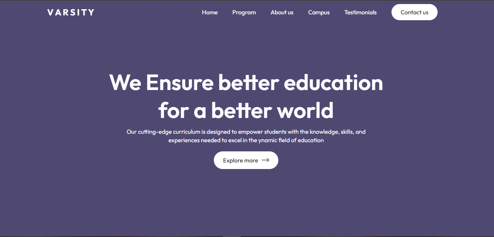

# University Information Website

This project is a React.js application designed to provide detailed information about a university. It includes information on courses, departments, faculty, campus facilities, and more, offering a centralized platform for users to learn about the university.

## Features

- **Home Page** with a brief introduction and highlights about the university.
- **Departments and Courses** section with details on various academic programs.
- **Faculty Profiles** to showcase information about professors and lecturers.
- **Campus Facilities** section providing insights into libraries, labs, sports complexes, and other amenities.
- **Contact Information** for prospective students and visitors.

## Technologies Used

- **React.js** - For building the user interface and managing component structure.
- **CSS** - For styling and layout adjustments across pages.

